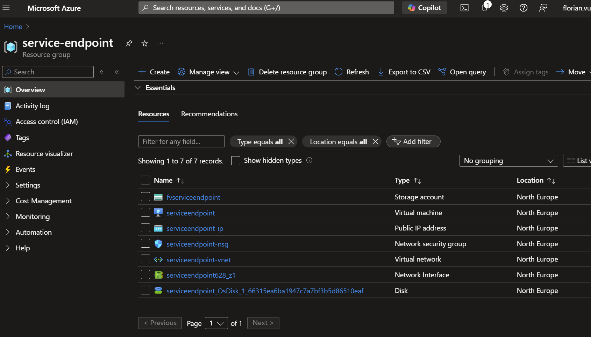
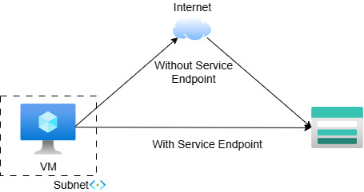
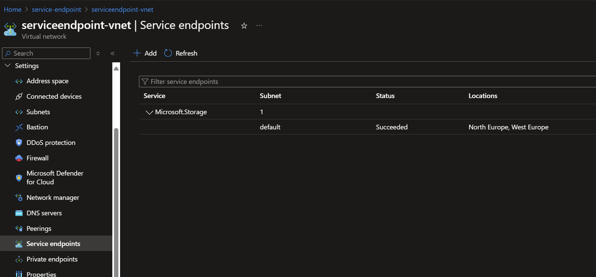
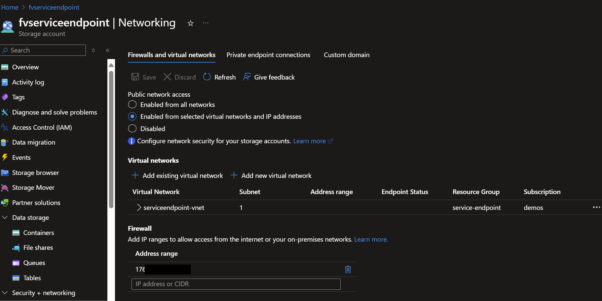
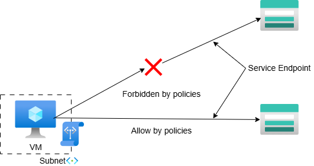
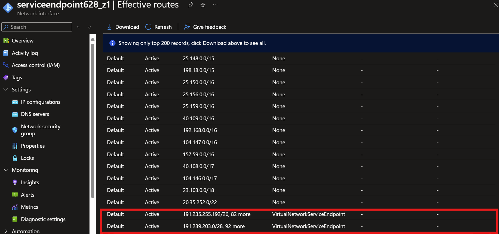
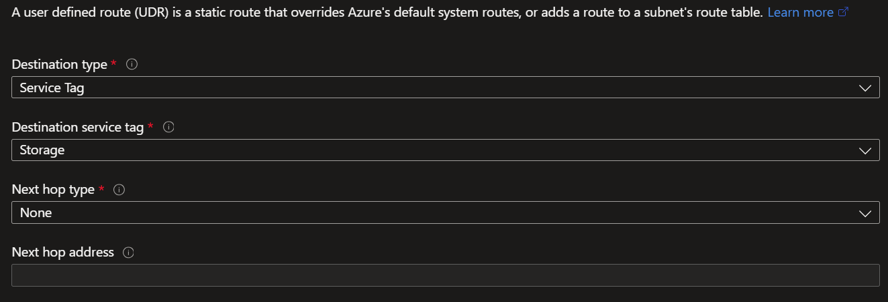

# Introduction

[Azure Service Endpoints](https://learn.microsoft.com/en-us/azure/virtual-network/virtual-network-service-endpoints-overview) are a good way to enhance security and optimize network performance in your Azure environment. This tutorial will explain what Azure Service Endpoints are, how they work, how to increase their security, their impact on routing, and their cost implications.

---

# Context: The Problem with Public Network Traffic

Imagine you have an [Azure Virtual Machine (VM)](https://learn.microsoft.com/en-us/azure/virtual-machines/overview) running inside a [Virtual Network (VNet)](https://learn.microsoft.com/en-us/azure/virtual-network/virtual-networks-overview) that needs to communicate with an [Azure Blob Storage](https://learn.microsoft.com/en-us/azure/storage/blobs/storage-blobs-introduction). By default, this communication occurs over the public internet, even though both resources reside in Azure. 

Here's how the default setup works:

- The VM sends requests to the Blob Storage account's **public endpoint** using a [public IP](https://learn.microsoft.com/en-us/azure/virtual-network/ip-services/public-ip-addresses).
- Traffic flows go over the public internet.
- Traffic reaches the Azure Blob Storage public endpoint.

This setup, while functional, is suboptimal for both security and performance.

---

# Configuration used for this article
All examples of this article are based on a Virtual Machine accessing to a Azure Storage Account with the following names:

---

# What is an Azure Service Endpoint?

An Azure Service Endpoint is a network link that connects a VNet directly to an Azure service. Instead of routing traffic over the public internet, Service Endpoints ensure that communication stays on Azure's backbone. 

## Key Features of Service Endpoints:
- They provide **direct and secure access** to Azure services.
- Traffic bypasses the public internet, reducing risks, latency and costs.
- The communication is directly visible at the resource firewall level.
- No IPs are consumed from the VNet.

Here's an example of how the network path is simplified with Service Endpoints:

## Service Endpoint Configuration

Service Endpoints are configured at the Subnet level and broadly allow the connection. Here, we can see the subnet can connect all storage accounts in North and West Europe:

## Configuring Access at the Resource Level

Resources must be explicitly allowed access from a subnet at the **resource firewall level**. For example, after enabling the Service Endpoint for Azure Blob Storage on the VM subnet, you need to configure the [storage account's firewall](https://learn.microsoft.com/en-us/azure/storage/common/storage-network-security?tabs=azure-portal) to allow access from that subnet:

## Restricting Access with Service Endpoint Policies

As explained, the subnet can now access all Azure Storage Accounts of North and West Europe, which is too broad for our use case.
[Service Endpoint Policies](https://learn.microsoft.com/en-us/azure/virtual-network/virtual-network-service-endpoint-policies-overview) offer fine-grained control by restricting which Azure Storage Account resources a subnet can access. Unlike resource-level restrictions, these policies apply to the **subnet** itself, governing outbound traffic from the subnet.

---

## Let's recap
Service Endpoints, Service Endpoint Policies, Resource firewalls... That's a lot for something "easy to manage". Let's do a quick recap:

- Service Endpoint: Allows direct communication from a subnet to a service. In our case, from the subnet of the VM to all Azure Storage Accounts in North or West Europe.
- Resource Firewall: Accepts communication from the subnet to its resource. In our case, from the VM subnet to the Azure Storage Account **fvserviceendpoint**.
- Service Endpoint Policies: Restrict access from a subnet to a list of designated Azure Storage Accounts.

---

# Routing and Optimization

Azure automatically updates the VNet's route table when a Service Endpoint is enabled, adding IP ranges that target the specified service. These updates ensure optimal routing for traffic to Azure services. 

Here are the "Effective Routes" of the VM's network interface:

## User-Defined Routes
You can override Service Endpoint routes by using **User-Defined Routes (UDR)** and service tags:

## Private Link
When Private Link is implemented, it overrides Service Endpoint routing for a specific resource due to its more specific IP announcements. This ensures Private Link traffic always takes precedence.

---

# Summary

Azure Service Endpoints are an excellent choice for securing and optimizing traffic within Azure without increasing costs and limiting the management overhead.
