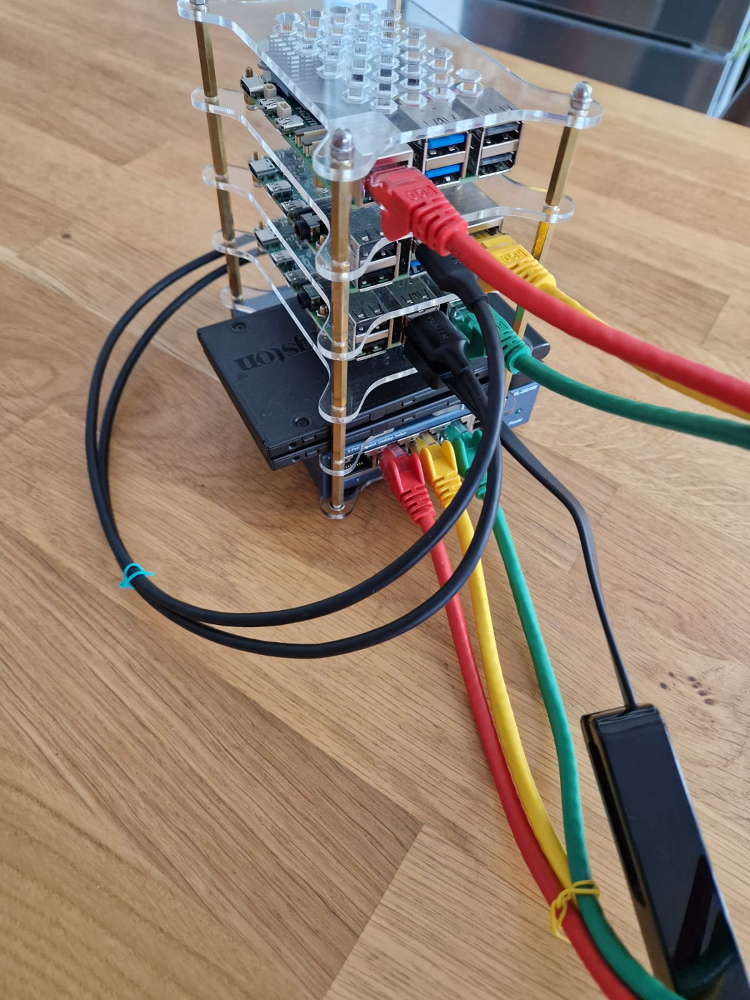

## Introduction

This is the second part of my journey building a private cloud at home with Raspberry Pi. In this post, I show what I bought, a photo of my cluster, and how everything is connected.

## What I Bought

Here is the list of all the hardware and accessories:

| Category   | Name | Quantity | Price |
|------------|------|----------|-------|
| Storage    | Kingston A400 SSD SSD Interne 2.5" SATA Rev 3.0, 240GB - SA400S37/240G | 2 | 29.99€ |
| Cable      | UGREEN Câble SATA USB 3.0 Adaptateur SATA USB pour SSD et Disques Durs 2,5 Pouces | 2 | 10.19€ |
| Rack       | GeeekPi 6-Couches Raspberry Pi Cluster Boîtier | 1 | 17.99€ |
| Storage    | SanDisk Ultra 32 GB microSDHC Memory Card + SD Adapter with A1 App Performance Up to 120 MB/s, Class 10, U1 | 3 | 8.15€ |
| Cable      | 1aTTack.de 10x 0,5m Câble Réseau Cat6 Cat 6 - RJ45 Ethernet LAN DSL Routeur Modem | 10 | 1.80€ |
| Network    | TP-LINK TPLINK Power-LAN PowerLAN PG2400P KIT (PG2400P KIT) | 1 | 90.53€ |
| Power      | LEGRAND Rallonge Multiprise Extra-Plate | 1 | 16.99€ | 
| Cable      | TP-Link Adaptateur USB Ethernet UE306, Adaptateur USB 3.0 vers Ethernet Gigabit | 1 | 16.99€ |
| Network    | TP-LINK TL-SG105 | 1 | 24.95€ |
| Power      | Alimentation pour Raspberry Pi 4 USB-C blanc avec Adaptateurs secteur | 2 | 12€ |
| Compute    | Raspberry Pi 4 modèle B - 8GB | 2 | 87€ |
| Cooling    | Ventilateur dissipateur pour Raspberry Pi 5 | 1 | 6€ |
| Compute    | Raspberry Pi 5 (Mémoire vive (RAM) : 16 GB) | 1 | 138€ |
| Power      | Alimentation Raspberry Pi 27W USB-C (Couleur : Blanc - Alimentation : Européenne (U.E)) | 1 | 13.20€ |

### Can't Make It Work

Some hardware did not work for me:

| Category   | Name | Quantity | Price |
|------------|------|----------|-------|
| Connectict | SABRENT Cable SATA to USB, Ultra-Rapide 5Gbps Adaptateur SATA USB 3.0 pour Lecteur Disque Dur et SSD 2,5" HDD/SSD | 1 | 11.99€ | 

### Not Used Yet

Some items worked, but I have not used them yet. I am not sure how to install them on the rack. Maybe I will use them later.

| Category   | Name | Quantity | Price |
|------------|------|----------|-------|
| Cooling    | Ventilateur de refroidissement pour Raspberry Pi | 2 | 2.95€ |

## My Cluster

Here is a photo of my setup:

 <!-- This photo shows the cluster fully connected, with the TP-Link UE306 adapter for internet -->

## How Everything is Connected

Here is how the cluster is organized and connected:

The rack layout (from bottom to top) is:
  1. Network switch
  2. Both SSD disks together
  3. Raspberry Pi 4 with disk and internet access (TP-Link UE306)
  4. Raspberry Pi 4 with disk only
  5. Raspberry Pi 5 (with a dedicated cooling fan)

Only the Raspberry Pi 4 models have SSDs connected.
Internet access to the cluster is provided by one Raspberry Pi 4.
All devices are connected to the switch with Cat6 Ethernet cables.
Each Raspberry Pi uses a different colored Ethernet cable, and its hostname matches the cable color for easier management.
MicroSD cards are used for booting the OS and storage.
Power supplies are not plugged in to keep the photo clear.

## Next Steps

In the next part, I will talk about how I use Ansible to set up the network.

## References & Thanks

Thanks to these blogs for helping me during my setup:
- https://jamesachambers.com/raspberry-pi-4-usb-boot-config-guide-for-ssd-flash-drives/
- https://www.raspberrypi.com/tutorials/cluster-raspberry-pi-tutorial/

