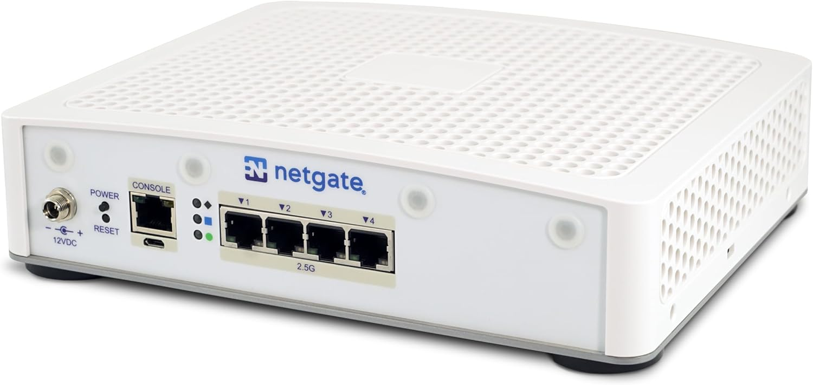
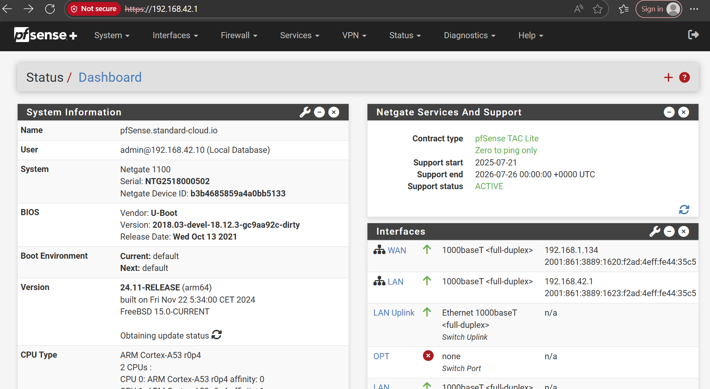
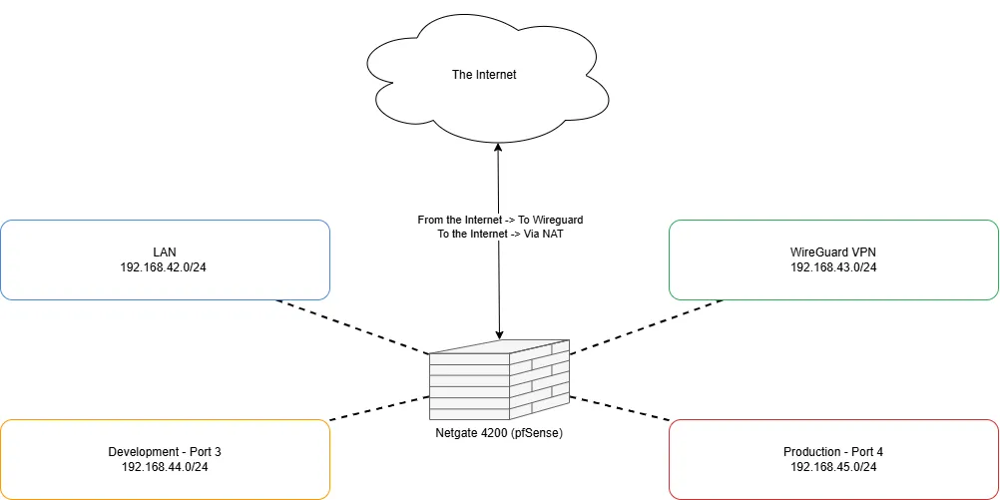

## Introduction

In the previous post I described using a Raspberry Pi as the gateway for my cluster. While that setup worked, it quickly showed limits in terms of performance and, coupled with new requirements, I had to reconfigure the network.

## Performance

During tests and configuration I noticed degraded performance: basic checks like `ping google.com` were slower than on my workstation, but I didn't consider that a major problem at first. When I began deploying applications I realized the network impact on traffic‑heavy workloads was too large for production.

At first I suspected the Raspberry Pi or the k3s configuration, but I eventually identified the main cause as the USB‑to‑Ethernet setup. Although the Pi's USB 3.0 bus can handle gigabit speeds in theory, I couldn't reach those rates on the adapter/interface I was using. The issue may be the Ethernet‑to‑USB adapter, driver, or a combination of factors.

## New needs

As I became more confident, I decided to expose the cluster from the Internet. That felt risky: in my professional life I expose apps publicly, but doing it on home infrastructure raises questions about security and DDoS resilience. To limit exposure I first published only a WireGuard VPN. Remote users must connect via WireGuard (or from the LAN) to reach services. I may open some applications later but prefer to avoid it for now.

## Network Appliance

I bought a Netgate 4200 running pfSense. I left the main LAN port unused for general traffic, assigned port 3 to a development subnet and port 4 to production, and configured WireGuard for remote access. The appliance simplified management, improved perceived security, and eliminated a lot of custom routing/DNS work - though I miss being able to manage everything with Ansible/IaC.

*Figure: Netgate 4200.*

*Figure: pfSense interface.*

## New configuration

Because pfSense now handles DHCP and DNS, I removed those components from my deployment scripts. Each machine gets its DNS name from its hostname and pfSense can route application hostnames directly. Users connected via WireGuard or LAN can access applications by name.

I configured the networks as:
- LAN: 192.168.42.1/24
- WireGuard: 192.168.43.1/24
- Development (port 3): 192.168.44.1/24
- Production (port 4): 192.168.45.1/24

*Figure: Network topology.*

> Note: this IP layout was somewhat constrained by the environment; I would prefer a /16 for easier scaling and simpler inter-subnet routing in the future.

## Conclusion

Adding a network appliance significantly improved the performance, the reliability and manageability of my private cloud. I can now connect to the cluster from anywhere and let users access applications more easily. I'm more confident about future expansion and excited to add a new location later.
