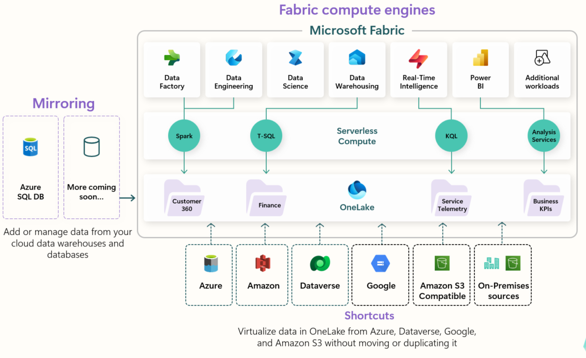

Azure Fabric is a powerful data platform that brings together various storage, processing, and integration capabilities under a unified system. This post will break down its core components in a simple and understandable way.

## OneLake: The Unified Data Lake

[OneLake](https://learn.microsoft.com/en-us/fabric/onelake/onelake-overview) is the foundational storage layer of Azure Fabric, designed to unify data from multiple sources without unnecessary duplication.

### Key Features:
- **Shortcuts:** Instead of moving data, [shortcuts](https://learn.microsoft.com/en-us/fabric/onelake/onelake-shortcuts) allow access to external sources like [AWS S3](https://learn.microsoft.com/en-us/fabric/onelake/create-s3-shortcut) or [Google Cloud](https://learn.microsoft.com/en-us/fabric/onelake/create-gcs-shortcut). They can also cache data for efficiency.
  - Deleting a shortcut has no impact on the underlying data; it is purely a Fabric feature.
  - Shortcut caching comes with limitations:
    - Maximum cache size: **1GB**
    - Cache retention: **24 hours**, based on last access time
    - Cache is updated if the remote object is modified.
- **Mirroring:** Keeps a real-time reflection of external data sources, including all operations such as updates and deletions.
- **Ingestion Methods:** Data can be ingested into OneLake using multiple methods:
  - **Dataflow Gen2**
  - **Data Factory Pipeline**
  - **Notebook**
  - **Shortcut**
  - **Mirroring**
  - **Eventstream**
  - **Direct uploads**
- **OneCopy:** Allows read-only access to data without needing to [copy it](https://learn.microsoft.com/en-us/fabric/onelake/onelake-overview#one-copy-of-data-with-multiple-analytical-engines).
- **ADLS Gen2 Compatibility:** OneLake is built on Azure Data Lake Storage Gen2 (ADLS Gen2) and is [compatible with it](https://learn.microsoft.com/en-us/fabric/onelake/onelake-access-api).
  - **Azure Storage Explorer** is compatible with OneLake due to its ADLS Gen2 support.
- **Delta Parquet Format:** By default, OneLake stores data in [Delta Parquet](https://delta.io/blog/delta-lake-vs-parquet-comparison/) format for optimized performance and analytics.

## Core Fabric Concepts
Azure Fabric consists of several key elements that help manage and organize data efficiently.

### 1. **Tenant**
- Represents the Azure tenant, which is the root level of an organization in Azure.
- It's more of an organizational concept and doesn't have a direct impact on data processing.

### 2. **Capacity**
- Defines the allocated CPU and memory resources required for processing data within Azure Fabric.
- It's a key factor in determining the cost of using Azure Fabric.

### 3. **Domain & Subdomain (Optional)**
- Way of logically [grouping together](https://learn.microsoft.com/en-us/fabric/governance/domains) elements within a company’s structure.
- A domain could represent a department, while subdomains could represent teams within that department.
- When linked to a workspace, it provides a way to manage access and security at a higher level.

### 4. **Workspace**
- A workspace acts as a central environment for managing and organizing data engineering projects.
- Can be linked to a single **capacity** and optionally to a **domain**.
- Similar to Power BI workspaces in structure.
- Controls security and access management:
  - **Admin, Member, Reader** roles.
  - Write access is at the workspace level (no granular access for individual notebooks).
  - Supports identity-based access control.
- **Lifecycle Management:** When linked to Git, the entire workspace can be version-controlled.
- **Integration with OneLake:** Each workspace functions as a logical container in OneLake.
- **Custom Configurations:** Supports Spark settings and network configurations.

### 5. **Items (Linked to Workspaces)**
Each workspace contains different items that are essential for data processing:
- **Notebook**
- **Pipelines**
- **Other Data Processing Components**

## CI/CD (Continuous Integration & Continuous Deployment)
Azure Fabric supports modern DevOps practices, enabling automation and version control of workspaces.

- **GitHub & Azure DevOps Integration**
- **Fabric APIs** for automating deployment and configuration

## Storage Options in Azure Fabric
Azure Fabric provides multiple storage options to suit different data processing needs:

1. **Lakehouse:** Best suited for managing structured and unstructured data using Delta Lake technology.
2. **Data Warehouse:** Optimized for structured, relational data with SQL-based querying.
3. **SQL Database:** A traditional relational database for transactional workloads.
4. **Eventhouse (KQL Database):** Designed for real-time event processing and analytics using Kusto Query Language (KQL).

## Billing in Azure Fabric

Azure Fabric follows a consumption-based billing model, where costs are determined by the allocated capacity (CPU and memory), storage usage, and specific features utilized. Workspaces linked to higher-capacity tiers incur greater charges, while ingestion, data processing, and shortcut caching can also contribute to costs. Additionally, leveraging Azure Storage Explorer and ADLS Gen2 compatibility does not introduce extra charges, but storage and data transfer costs apply based on usage.

## Conclusion
Azure Fabric is a comprehensive platform that simplifies data management by integrating storage, processing, and security into a single system. With OneLake as the backbone and flexible storage and ingestion options, it provides a powerful solution for modern data engineering. Whether you are working with structured data in a warehouse, real-time events, or unstructured data in a lakehouse, Azure Fabric offers the necessary tools to streamline your workflow.
