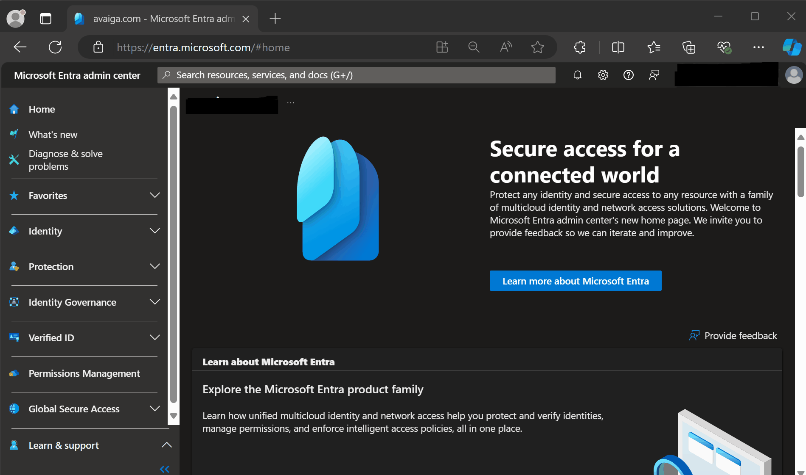
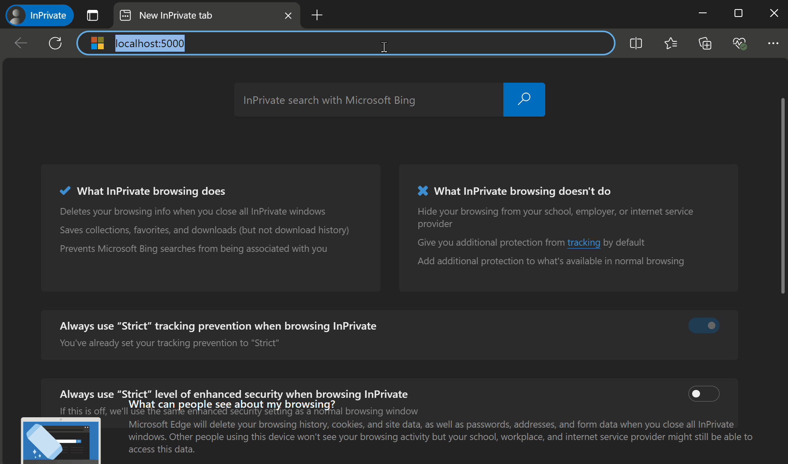

This documentation provides a step-by-step guide to creating an application in Microsoft Entra ID and using OAuth 2.0 for authentication in a Python web application. By following this guide, you will be able to authenticate users with their Microsoft Entra accounts using Single Sign-On (SSO). This integration enhances security and simplifies the login process for users by leveraging Microsoft's robust identity management platform.

# What is Entra ID

(Microsoft Entra ID)[https://learn.microsoft.com/en-us/entra/fundamentals/whatis] is a comprehensive identity and access management solution for the cloud. It provides a robust set of capabilities to manage users and groups, secure access to applications, and ensure compliance with organizational policies.

This service is used by [Azure](https://azure.microsoft.com/en-us) but both services are independent and Microsoft Entra ID can be used on its own without Azure.

Last point, Microsoft Entra ID is a service provided by [Microsoft Entra](https://learn.microsoft.com/en-us/entra/fundamentals/what-is-entra) that refers to the broader suite of identity and access management solutions offered by Microsoft.

# Creates the Entra Application

1. **Navigate to the Entra Portal**
   - Open your web browser and go to [Microsoft Entra Portal](https://entra.microsoft.com).

2. **Sign In**
   - Sign in with your Microsoft account credentials.

3. **Create a New Application**
   - In the left-hand navigation pane, select **"Identity"** then **"Applications"** and click on **"App registrations"**.
   - Click on **"New registration"**.

4. **Configure the Application**
   - Enter the name of the application.
   - Choose the supported account types. For most use cases, select **"Accounts in this organizational directory only"**.
   - Under **Redirect URI**, select **"Web"** and enter the URL `http://localhost:5000/callback` where your application will handle sign-in responses.
   - Click **"Register"**.

5. **Copy the Application (client) ID**
   - After registration, you will be redirected to the application's overview page. Note down the **Application (client) ID** as you will need it later.

6. **Generate a Client Secret**
   - In the left-hand menu, select **"Certificates & secrets"**.
   - Under **Client secrets**, click **"New client secret"**.
   - Add a description and choose an expiration period.
   - Click **"Add"** and note down the **Value** of the client secret.



# Creates the Python Web Application

Now time to create the Python Web Application using the Microsoft Entra Application as identity provider.

### Prerequisites

Before you begin, ensure you have Python installed on your machine. You will also need to install the following packages:

- `Flask`: A lightweight WSGI web application framework.
- `Authlib`: A library for building OAuth and OpenID Connect clients and servers.
- `requests`: A library for HTTP requests used by Authlib.

You can install these packages using pip:

```sh
pip install Flask Authlib requests
```

Officials documentation:
- (Authlib)[https://docs.authlib.org/]
- (Flask)[https://flask.palletsprojects.com/en/3.0.x/]
- (Requests)[https://requests.readthedocs.io/en/latest/]

### Code

Here the Python Web Application without the credentials previously created.

```python
$ cat app.py
from flask import Flask
from authlib.integrations.flask_client import OAuth

app = Flask(__name__)

# Secret key for the user session.
app.secret_key = 'randomkey'

# Application credentials.
CLIENT_ID = "<CLIENT-ID>"
CLIENT_SECRET = "<CLIENT-SECRET>"

# Endpoint for the connection are based on the tenant ID.
TENANT_ID = "<TENANT-ID>"
ACCESSS_TOKEN_URL = f"https://login.microsoftonline.com/{TENANT_ID}/oauth2/v2.0/token"
AUTHORIZE_URL = f"https://login.microsoftonline.com/{TENANT_ID}/oauth2/v2.0/authorize"

# Connection to the Microsoft Entra API using the application previously created.
oauth = OAuth()
oauth.init_app(app)
oauth.register(
    name='entra',
    client_id=CLIENT_ID,
    client_secret=CLIENT_SECRET,
    access_token_url=ACCESSS_TOKEN_URL,
    authorize_url=AUTHORIZE_URL,
    client_kwargs={
        'scope': 'User.Read'
    },
)

@app.route('/')
def login():
    """
    Route to start the login process.
    """
    redirect_url = "http://localhost:5000/callback"
    return oauth.entra.authorize_redirect(redirect_url)

@app.route("/callback")
def callback():
    """
    Route called by Microsoft Entra after user login.
    Retrieve access token to retrieve user profile then return it.
    """
    resp = oauth.entra.authorize_access_token()
    resp = oauth.entra.get('https://graph.microsoft.com/v1.0/me')
    resp.raise_for_status()
    profile = resp.json()
    return profile
```

Running this file with the command `flask run` starts a webserver available at `http://localhost:5000` running the OAuth workflow and retrieving user information.



# Conclusion

This integration not only enhances the security of your application but also simplifies the login process for your users by leveraging Microsoft's robust identity management platform. You can now extend this setup to include additional Microsoft Graph API calls or further customize the authentication flow to suit your needs.
