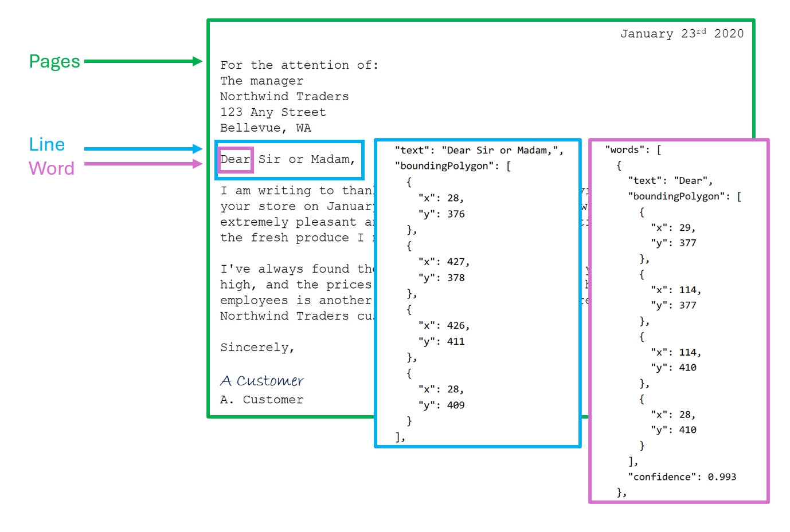

> **Disclaimer:** These are my personal learning notes. Do not consider them an official source of truth.

---

## Understanding Images

An image is composed of a 2D grid of pixels. Each pixel has a numerical value representing its color.

### Example

A 3x3 RGB image:

```
[
  [[255, 0, 0], [0, 255, 0], [0, 0, 255]],
  [[0, 255, 0], [0, 0, 255], [255, 0, 0]],
  [[0, 0, 255], [0, 255, 0], [255, 0, 0]]
]
```

---

## What is a Filter?

Filters process images by performing operations such as edge detection or blurring. A filter is a small matrix applied to pixels by sliding across the image and performing mathematical operations at each position. The output of a filter can, for example, highlight edges in the image.

### Example of Convolution

Here's a visual representation of 2D convolution using a filter:


*Source: [Wikipedia](https://en.m.wikipedia.org/wiki/File:2D_Convolution_Animation.gif)*

---

## Vision Algorithms

### Convolutional Neural Networks (CNNs)

CNNs are widely used for image classification and are often combined with object detection and semantic segmentation for complex tasks.

CNN architectures typically consist of:
- **Convolution layers:** Apply filters to detect features.
- **Pooling layers:** Reduce spatial dimensions.
- **Fully connected layers:** Classify or interpret features.

### Multi-modal Models

Multi-modal algorithms combine data from different sources — such as images and text — to enhance model accuracy and understanding. 

These models usually include:

- **Image Encoder:** Transforms image data into numerical representations.
- **Text Encoder:** Converts textual data into numerical representations.

Typical multi-modal architectures consist of:

- **Foundation Models:** General-purpose models pre-trained on large datasets by major tech companies.
- **Adaptive Models:** Fine-tuned specifically for particular tasks or industries.

---

## Azure AI Face Service

### What is Facial Recognition?

Facial recognition identifies individuals based on unique facial features using biometric data. It also includes face detection (locating faces within images).

### Azure AI Face Service

Azure's dedicated AI Face Service detects faces and their attributes within images, including:

- Accessories
- Blurriness
- Exposure quality
- Presence of glasses
- Recognition quality

Advanced features, such as face verification or identification, are available under certain conditions.

This service can be used independently or integrated into Azure AI services.

The service must be created and then accessed via Vision Studio.

---

## Azure AI Vision

Azure AI Vision provides extensive image analysis capabilities, operating independently or as part of Azure AI services.

Key features include:
- **Optical Character Recognition (OCR):** Extracting text from images.
- **Image captioning and descriptions:** (e.g., "A man jumping on a skateboard").
- **Object Detection:** Identifying common objects in images.
- **Tagging visual features:** e.g., sports (99.6%), person (99.56%), footwear (98.05%).
- **Facial Detection:** Identifying faces and bounding boxes (less comprehensive than Azure AI Face).

### Optical Character Recognition (OCR)

OCR, known as "Azure AI Vision's Read API," extracts text from images, providing structured output like Page, Line, and Word positions.

Example from Azure training:



*Source: [Microsoft learn](https://learn.microsoft.com/en-us/training/modules/read-text-computer-vision/2-ocr-azure)*

---

## Azure Vision Studio

Azure Vision Studio is a graphical tool that provides an intuitive way to use pre-built vision models.

- Drag-and-drop interface or API usage.
- Requires an Azure AI Vision or Azure AI services instance.
- Simplifies instantiation and model usage.

**Note:** Previously, Vision Studio supported training custom models for classification and object detection, but this feature is now deprecated.

URL: [Azure Vision Studio](https://portal.vision.cognitive.azure.com/)

---

## Azure Custom Vision

Azure Custom Vision is a no-code service that enables users to easily create, evaluate, and deploy custom models for:

- Image classification
- Object detection with segmentation

Features:
- User-friendly drag-and-drop interface
- Dataset labeling and preparation
- Custom model training

Access: [Custom Vision Website](https://www.customvision.ai/)

