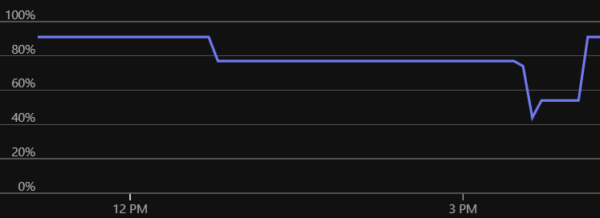

## Introduction

This article is about a real memory management issue I faced in Python. It's not a classic tutorial, but more a story of how I struggled and finally found a solution.

## The big picture

I was working on a data collection program. It has modules that grab data from different sources and then aggregate them. A few days after deploying it to production (on an Azure VM with 16GB RAM), we started seeing memory issues.

After checking logs and metrics, we found the problem area. The endpoint was returning much more data than expected: about 6 to 7GB. This was normal for the data, but too much for our VM and more then what we expected. We upgraded to a 32GB machine to buy time and improve the code.

Here is a simplified version of the problematic code:

```python
def my_function_causing_memory_issue():
    # Retrieve data from an URL.
    page_content = requests.get(url='<huge-data>')

    # The page is a JSON, so convert it.
    data = page_content.json()

    for key, block_1 in data.get('first-block').items():
        ...

    for key, block_2 in data.get('second-block').items():
        ...
```


## First improvement

Loading the whole JSON in memory is not smart. So, we used the [`ijson`](https://pypi.org/project/ijson/) library to process the JSON in a streaming way.

The code became:

```python
import tempfile
import ijson
import requests

def my_function_causing_less_memory_issue():
    with tempfile.TemporaryFile() as fd:
        # Retrieve data from an URL.
        page_content = requests.get(url='<huge-data>')
        fd.write(page_content.content)
        del page_content

        fd.flush()
        fd.seek(0)

        for key, block_1 in ijson.kvitems(fd, 'first-block'):
            ...

        fd.seek(0)
        for key, block_2 in ijson.kvitems(fd, 'second-block'):
            ...
```

This reduced memory usage because we didn't keep the JSON string and dict in memory. But memory was still higher than expected, and we couldn't go back to a 16GB machine.

## Next iteration

Instead of loading all data in memory before writing to disk, we wrote it directly to disk in 1MB chunks.

```python
import tempfile
import ijson
import requests

def my_function_causing_less_memory_issue():
    with tempfile.TemporaryFile() as fd:
        # Retrieve data from an URL.
        with requests.get('<huge-data>', stream=True) as response:
            for chunk in response.iter_content(chunk_size=1024 * 1024):
                fd.write(chunk)

        fd.flush()
        fd.seek(0)

        for key, block_1 in ijson.kvitems(fd, 'first-block'):
            ...

        fd.seek(0)
        for key, block_2 in ijson.kvitems(fd, 'second-block'):
            ...
```

This was better, but memory usage was still higher than expected.

> **Note:** On my Windows Linux Subsystem, I saw strange memory behavior, like if the string was still loaded in memory before writing. But on the Linux VM, it was fine.

## Back to basics: Python scope

After a lot of research, the answer was simple: Python's memory scope is at the function level, not the indentation. For example:

```python
for i in [1, 2, 3]:
    ...
assert i == 3
```

The memory graph showed fluctuations, then a step up, then more fluctuations.


*Figure: Memory usage before scoping.*

The solution was to split the processing into functions.

```python
import tempfile
import ijson
import requests

def process_block_1(fd):
    for key, block_1 in ijson.kvitems(fd, 'first-block'):
        ...

def process_block_2(fd):
    for key, block_2 in ijson.kvitems(fd, 'second-block'):
        ...

def my_function_causing_less_memory_issue():
    with tempfile.TemporaryFile() as fd:
        # Retrieve data from an URL.
        with requests.get('<huge-data>', stream=True) as response:
            for chunk in response.iter_content(chunk_size=1024 * 1024):
                fd.write(chunk)

        fd.flush()
        fd.seek(0)
        process_block_1(fd)
        fd.seek(0)
        process_block_2(fd)
```

After this change, the memory graph should no longer show step-like jumps!

## Conclusion

Even after years of Python, this simple mistake was hard to find. I read the code many times before understanding the basic memory scope issue.

Now, I am thinking about more optimizations, like lazy loading each key of each block, but the current memory usage is good enough. The balance between readability and performance is fine for now.

Thanks to these improvements, this application is now ready to run on my Raspberry Pi cluster. If you are interested in private cloud setups, check out my [private cloud articles](../behind-the-cloud/part-1-introduction).
